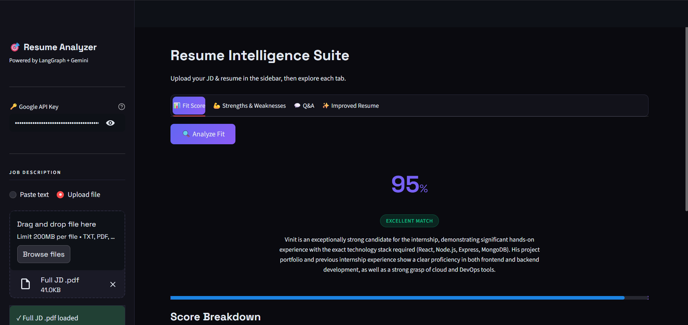
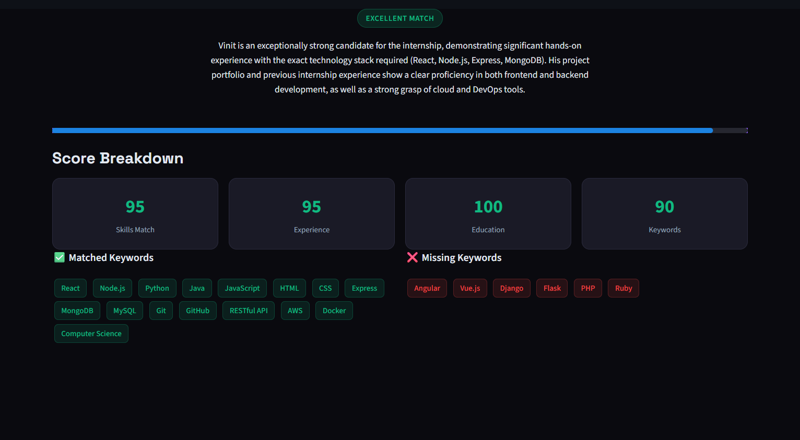
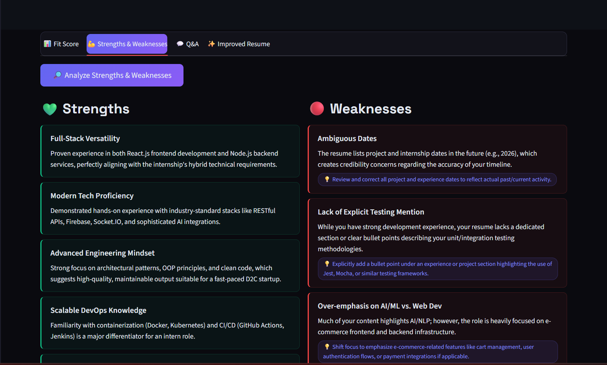
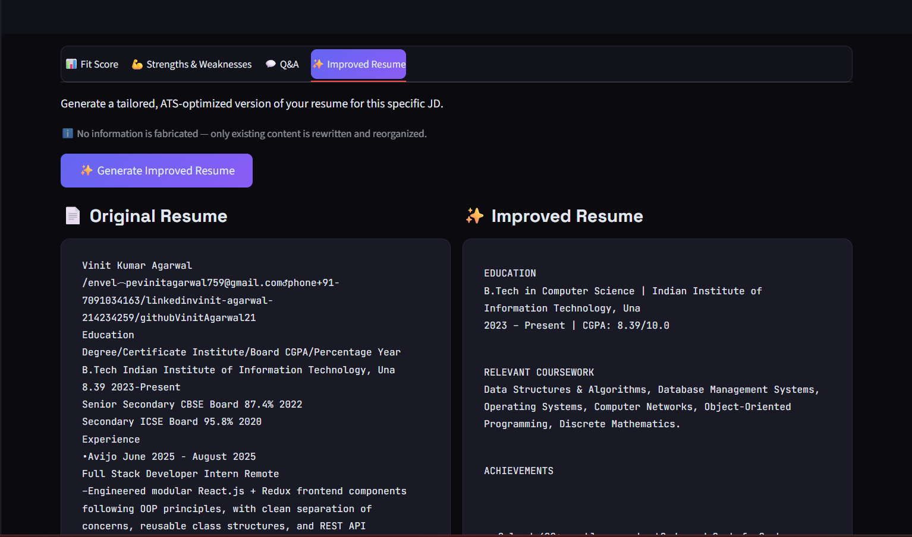
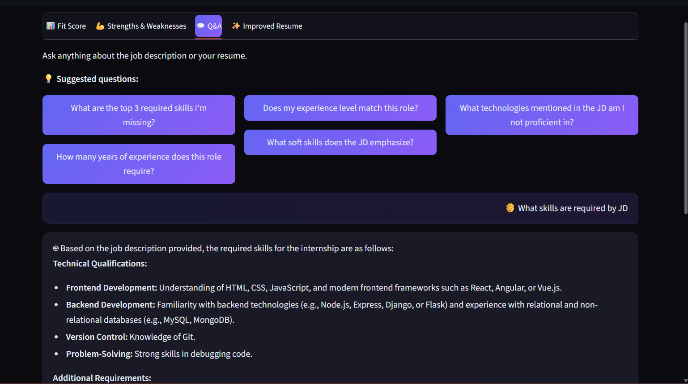

# Resume Amplifier AI — LangGraph + Streamlit

An AI-powered resume analysis agent built with **LangGraph** and **Gemini**, with a polished **Streamlit** frontend.

## Features

| Tab | What it does |
|-----|-------------|
| 📊 **Fit Score** | ATS-style match score (0–100) with keyword and category breakdowns |
| 💪 **Strengths & Weaknesses** | Detailed pros/cons of your resume relative to the JD |
| 💬 **Q&A** | Chat-style Q&A — ask anything about the JD or your resume |
| ✨ **Improved Resume** | AI-rewrites your resume for the specific JD (no fabrication) |


## Overview






## Architecture

```
Streamlit UI
    │
    ▼
LangGraph StateGraph
    │
    ├── fit_score_node         → JSON score + keyword analysis
    ├── strengths_weaknesses_node → structured pros/cons
    ├── qa_node                → contextual Q&A
    └── resume_rewriter_node   → tailored resume text
```

Each tab invokes the graph with a different `task` value. The router dispatches to the correct node.

## Setup

### 1. Clone / copy files
```
resume_agent/
├── app.py           # Streamlit frontend
├── agent.py         # LangGraph agent
├── requirements.txt
└── README.md
```

### 2. Install dependencies
```bash
pip install -r requirements.txt
```

### 3. Run
```bash
streamlit run app.py
```

### 4. Use
- Open `http://localhost:8501` in your browser
- Enter your **Google API key** in the sidebar
- Paste or upload your **Job Description** and **Resume** (`.txt`, `.pdf`, or `.docx`)
- Explore each tab!

## Environment variable (optional)
Instead of entering the key in the UI, you can set it beforehand:
```bash
export GOOGLE_API_KEY=Az...
streamlit run app.py
```

## Supported file formats
- Plain text (`.txt`)
- PDF (`.pdf`) — text-based PDFs; scanned PDFs may not extract well
- Word documents (`.docx`)
